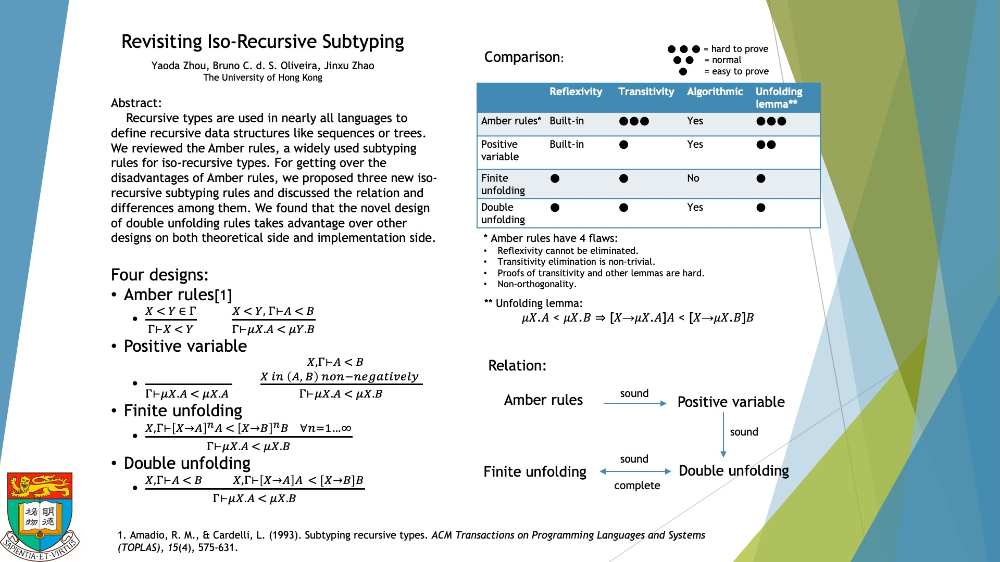

Revisiting Iso-Recursive Subtyping (Artifact)
-----

## Update (2020-11-27)
Thanks to [Prof. John Boyland](https://uwm.edu/engineering/people/boyland-ph-d-john/) for providing another kind of proof to this paper. It uses [SASyLf](https://github.com/boyland/sasylf), a proof assistant that using HOAS (higher order abstract syntax) technique while the original Coq proof uses locally nameless. You can find the full proofs in file ```iso-recursive-sub2.slf```.

## Update (2020-11-25)

Compared with the OOPSLA paper, we add some new contents in our poster.
For example, we show that we have proven the **unfolding lemma on algorithmic system**. The proof script is quite simple and elegant.

Below is the table that guides you to the positions of all lemmas.

|  | Reflexivity | Transitivity | Algorithmic | Unfolding lemma |
|  ----  | ----  | ---- | ---- | ---- |
| Amber rules | built-in | N/A | Y | N/A |
| Positive variable | built-in | ```sub_amber2_trans```(subtyping3.v) | Y | ```unfolding_for_pos```(subtyping3.v) |
| Finite unfolding (declarative) | ```refl```(subtyping.v) | ```Transitivity ``` (subtyping.v) | N | ```unfolding_lemma```(subtyping.v) |
| Double unfolding (algorithmic) | ```refl_algo``` (subtyping.v) | ```trans_algo```(subtyping.v) | Y | ```unfolding_lemma_version2```(subtyping2.v) | 


## Update (2020-11-19)
After getting conditional accepted by OOPSLA, I thought out a new simpler proof for proving unfolding lemma and soundness.
As the result, there is no need to define ```subderivation```. 
_You can feel free to forget section 4.3_ .
The complete proof can be found at file ```subtyping2.v```.

## Abstract
This bundle contains the Coq formulation associated with the paper "Revisiting Iso-Recursive Subtyping". This document explains how to run the Coq formulations. 

## Getting Started

We strongly recommend you to install Coq proof assistant by ```opam2```.

1. Install [Coq](https://coq.inria.fr/opam-using.html)(>=8.10). The latest version of Coq is 8.12. In Ubuntu-like system, you can install Coq by typing these commands in terminal.
	
		
		>> opam install opam-depext
		>> opam-depext coq
		>> sudo apt-get install m4
		>> opam pin add coq 8.12.0
		

2. Install [metalib](https://github.com/plclub/metalib). In terminal, type

		
		>> git clone https://github.com/plclub/metalib.git
		>> cd metalib/Metalib
		>> make
		>> make install
		
3. Now to compile our Coq proof where a ```makefile``` is provided. In command line, cd to the ```src``` directory and then build the whole project.
	
		
		>> cd path_to_src
		>> make clean
		>> make
		>> make html
		


## Coq files

| Coq File | Description |
|  ----  | ----  |
| definition.v | The definition of the SLTC extended with our recursive subtyping formulation, including Well-Formedness, Subtyping (declarative and algorithmic), Typing, Reduction, Subderivation and Negative Subtyping. |
| infra.v | Infrastructure about locally nameless. |
| subtyping.v | Theorems about subtyping. |
| typesafety.v | Theorems about type soundness. |
| decidability.v| Theorem showing that our recursive subtyping is decidable. |
| amber\_part_1.v |  Definitions of Amber rules and positive restriction. Theorem showing that amber rules is sound w.r.t to the positive restriction. |
| amber\_part_2.v | Theorem showing that amber rules is sound w.r.t to our subtyping formulation. |

## Definitions
| Definition |  File | Name of formalization | Notation |
|  ----  | ----  | ---- | ---- |
| Well-formed Type (Figure 3) | definition.v | WF E A | $\Gamma \vdash A $ |
| Well-formed Type (Definition 2)** | definition.v | WFS E A | $\Gamma \vdash A $ |
| Declarative subtyping (Figure 3) | definition.v | Sub E A B | $\Gamma \vdash A \le B $ |
| Typing (Figure 4) | definition.v | typing E e A | $ \Gamma \vdash e : A $ |
| Reduction (Figure 4) | definition.v | step e1 e2  | $ e_1 \hookrightarrow e_2 $ |
| Algorithmic subtyping (Figure 5) | definition.v | sub E A B | $\Gamma \vdash_{a} A \le B $ |
| Subtyping Subderivation (Figure 6) | definition.v | Der m E2 A B E1 C D | $\Gamma_1, \Gamma_2 \vdash A \le B \in_{m} C \le D $ |
| Negative Subtyping (Figure 6) | definition.v | NTyp E m X A B | $\Gamma \vdash_{m}^{\alpha} A \le B $ |
| Well-formed Type of Amber rules (Figure 7) | amber\_part\_1.v | wf_amber E A | $\Delta \vdash A $ |
| Amber rules (Figure 7) | amber\_part\_1.v | sub_amber E A B | $\Delta \vdash_{amb} A \le B $ |
| Positive restriction (Figure 8) | amber\_part\_1.v | posvar m X A B | $\alpha \in_{m} A \le_{+} B $ |
| Positive subtyping (Figure 8) | amber\_part\_1.v | sub\_amber2 E A B | $\Gamma \vdash A \le_{+} B $ |


* **This definition of well-formed contains rule ```WFT-INF``` instead of ```WFT-REC```. We prove that ```WFS``` is sound and complete w.r.t ```WF``` by lemmas ```soundness_wf``` and ```completeness_wf``` in file ```subtyping.v```.


## Lemmas and Theorems

| Lemma/Theorem |  File | Lemma Name in Coq File |
|  ----  | ----  | ---- |
| Theorem 4 (Reflexivity)| subtyping.v | refl |
| Theorem 5 (Transitivity) | subtyping.v | Transitivity |
| Lemma 7 (Unfolding Lemma) | subtyping.v | unfolding_lemma |
| Theorem 9 (Preservation) | typesafety.v | preservation |
| Theorem 10 (Progress) | typesafety.v | progress |
| Theorem 12 (Reflexivity)| subtyping.v | refl_algo |
| Theorem 13 (Transitivity) | subtyping.v | trans_algo |
| Theorem 14 (Completeness of algorithmic subtyping) | subtyping.v | completeness |
| Theorem 21 (Soundness of algorithmic subtyping) | subtyping.v | soundness |
| Theorem 22 (Decidability) | decidability.v | decidability |
| Theorem 28 (Soundness of the Amber rules) | amber\_part\_2.v | amber\_soundness |

